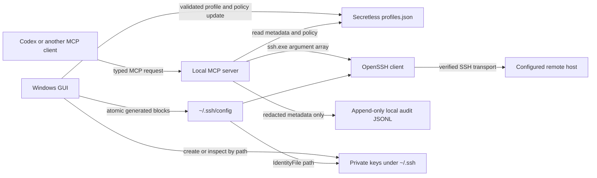

# Architecture

This document defines the target architecture for SSH Remote Manager Phase 1. Where legacy code differs, this document describes the migration destination rather than treating the legacy behavior as a second source of truth.

## Goals and invariants

SSH Remote Manager is a personal Codex plugin with a local MCP server and a companion Windows GUI. The GUI owns profile, key, and policy administration. The MCP server consumes those profiles by alias and exposes only constrained, read-only operations.

The plugin identifier is `ssh-remote-for-ai`, displayed as **SSH Remote Manager**. Its Phase 1 MCP implementation is the Python 3 standard-library server at `server/ssh_remote_mcp.py`; keeping the runtime dependency-free reduces installation and supply-chain surface.

The following invariants apply across every component:

- Private-key content never crosses a process boundary, enters an MCP result, or appears in logs or exceptions.
- Passwords are neither accepted nor stored.
- Phase 1 has no arbitrary-command, interactive-shell, deploy, restart, or migration tool.
- Production profiles are read-only by default; Phase 1 provides no policy switch that makes them mutable.
- All SSH invocations use an executable plus an argument array. User input is never interpolated into a local shell command and `shell=True` is forbidden.
- No automated test connects to a real server. Integration tests use a fake SSH executable.

## Components and trust boundaries



The MCP boundary is deliberately narrower than the GUI boundary. MCP can observe approved metadata and invoke fixed read-only probes. It cannot create, rename, delete, or export profiles or keys. The OpenSSH process may read a private key by path as part of authentication; neither the GUI nor MCP reads the key bytes for transport, display, telemetry, or audit.

## Canonical local state

The canonical profile store is the secretless JSON file:

`%USERPROFILE%\.ssh\ssh-remote-manager\profiles.json`

It is the single source of truth for managed profile metadata and policy. `~/.ssh/config` is a generated compatibility surface for OpenSSH and is not a second database. Managed SSH blocks may be regenerated from JSON. Unmanaged SSH configuration must remain byte-for-byte unchanged apart from the minimum newline needed at a managed-block boundary.

The Phase 1 store uses `schemaVersion: 1` and profiles keyed by alias. Each profile carries the following persisted fields:

- `alias`, `displayName`, `host`, `port`, `user`, and `environment`;
- `identityFile`, a private-key path reference, never key content;
- `capabilities` with explicit `serverInfo`, `systemd`, `docker`, and `logs` grants;
- `allowlists.services`, containing allowed service names;
- `allowlists.logTargets`, approved `{name, path}` entries that map target names to fixed remote paths; and
- `lastTestedUtc` connection-status metadata.

Every profile must declare exactly one environment: `development`, `staging`, or `production`. Missing or unknown environments fail closed. Capabilities and allowlists are grants, not hints: absence means denial.

Private keys stay below the resolved user `~/.ssh` directory. The application validates that a key path resolves inside that directory and is not a directory, device, symlink escape, or command-line option. Public-key material may be displayed or copied for onboarding, but public and private material are always handled as different data classes.

## Managed SSH config boundary

New generated blocks use neutral markers:

```text
# BEGIN SSH REMOTE MANAGER: example-alias
Host example-alias
    HostName example.internal
    User deploy-reader
    Port 22
    IdentityFile C:/Users/name/.ssh/ssh-remote-manager/example-alias
    IdentitiesOnly yes
# END SSH REMOTE MANAGER: example-alias
```

Legacy blocks using `# BEGIN KEBLM MANAGED SSH: <alias>` and the matching end marker are recognized only for backward-compatible import and migration. Migration parses a complete, well-formed block, validates its values, creates a JSON profile, and replaces only that block with the neutral form. Ambiguous, nested, duplicate, unterminated, wildcard, `Match`, or `Include` structures are not rewritten automatically.

Generic `Host *`, wildcard hosts, `Include`, and other unmanaged entries remain read-only until the user explicitly selects a concrete host for import. A managed alias must not collide with an unmanaged `Host` token.

Before any config rewrite, the writer:

1. acquires a process-safe lock file;
2. rereads both JSON and SSH config while holding the lock;
3. validates aliases, paths, uniqueness, and managed marker structure;
4. writes temporary files in the destination directory and flushes them;
5. creates a timestamped backup of the existing SSH config;
6. atomically replaces the destination files; and
7. releases the lock in a `finally` path.

If any step fails, the old files remain usable. A stale lock is not silently broken without verifying that its owner is gone. Concurrent GUI instances cannot perform last-writer-wins updates.

## Profile lifecycle

Profile rename is a metadata/config operation, not implicit key rotation. The key reference remains unchanged unless the user separately requests and confirms a key move or rotation. A rename must reserve the new alias, update the JSON object and generated managed block atomically, and leave no duplicate old block.

Three destructive actions are intentionally separate:

1. **Revoke remote public key** removes the matching public-key authorization from a server and requires explicit user action and confirmation. It is not available through Phase 1 MCP.
2. **Remove local profile** removes JSON metadata and its managed SSH block after confirmation. It does not revoke remote access and does not delete a key.
3. **Delete local key** removes selected local key files only after a separate, explicit confirmation and a dependency check. It does not imply remote revocation.

Uninstall removes plugin/runtime integration only. It preserves profiles, audit records, SSH config, and all keys unless the user invokes a separate data-removal workflow.

## MCP execution model

Each MCP request follows the same pipeline:

1. Parse a typed request and reject unknown fields where practical.
2. Validate the alias syntax before lookup; never accept a hostname as an alias substitute.
3. Load the canonical profile and check environment, capability, and allowlist policy.
4. Resolve a fixed operation template defined in code.
5. invoke `ssh.exe` with an argument array, `BatchMode=yes`, a bounded connection timeout, and strict host-key verification after onboarding;
6. enforce total duration and stdout/stderr byte limits while the process runs;
7. classify the result and redact all returned text; and
8. append a metadata-only audit event.

Phase 1 tools are:

- `ssh_list_profiles`: safe profile summary, excluding the key path and all key material;
- `ssh_get_profile`: metadata/policy plus a boolean or state describing key readiness;
- `ssh_test_connection`: bounded BatchMode probe with latency and a sanitized error category;
- `ssh_get_server_info`: fixed commands for hostname, OS, uptime, CPU, memory, and disk summaries;
- `ssh_service_status`: fixed read-only systemd or Docker inspection for an allowed service;
- `ssh_read_logs`: a bounded read of an allowed named target, never an arbitrary path;
- `ssh_audit_recent`: recent local metadata-only audit events.

Remote operation templates are constants in code. Service names and log targets select predeclared templates; they are never concatenated into an unconstrained shell expression. Numeric options such as line counts are parsed as integers and clamped. All remote commands include an option terminator or equivalent positional protection where supported.

## Error and output contract

Errors returned to MCP identify a stable category such as `validation`, `policy_denied`, `missing_key`, `host_key`, `authentication`, `unreachable`, `timeout`, `output_limit`, or `internal`. They may include a short redacted explanation but never raw process arguments, environment variables, command output, stack traces, or filesystem paths containing sensitive user information.

Output limits are enforced on bytes read, not only after collecting complete output. On timeout or overflow, the process tree is terminated and partial output is discarded or returned only after redaction according to the tool contract.

## Audit architecture

Audit records are append-only JSON Lines at `%USERPROFILE%\.ssh\ssh-remote-manager\audit.jsonl`. Each event contains UTC timestamp, tool, profile alias, environment, duration, success/failure, and an exit category. Optional fields are limited to request-safe values such as a named service or log target after validation.

Audit does not contain full command lines, remote stdout/stderr, private-key paths or contents, passwords, tokens, connection strings, or environment dumps. Rotation uses configured size and retention bounds and preserves complete JSONL records. Audit reading applies the same schema filter and redaction as audit writing.

## Host-key onboarding

Unknown hosts fail closed in MCP. Initial trust establishment is a GUI/user workflow: the user independently verifies the server fingerprint, accepts it into the normal OpenSSH known-hosts store, and retests. Phase 1 MCP must not use `StrictHostKeyChecking=no`, silently replace a changed key, or present an unknown key as trusted. Subsequent connections require strict verification.

## Compatibility and evolution

Schema changes increment the JSON schema version and use explicit, testable migrations. Migration creates backups and never destroys legacy data merely because a field cannot be interpreted. The GUI and MCP runtime must reject a store version newer than they support rather than partially applying it.

See [SECURITY.md](SECURITY.md) for controls, [THREAT_MODEL.md](THREAT_MODEL.md) for abuse analysis, and [PHASE2.md](PHASE2.md) for deliberately deferred capabilities.
